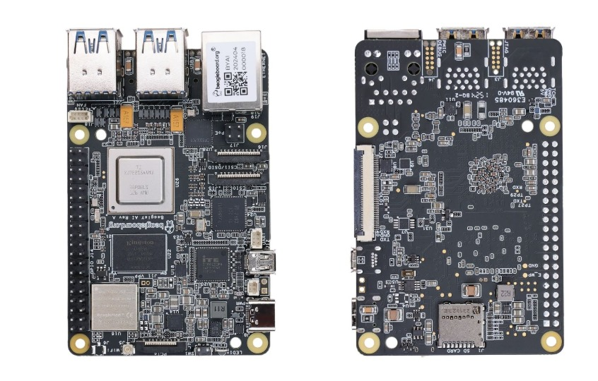
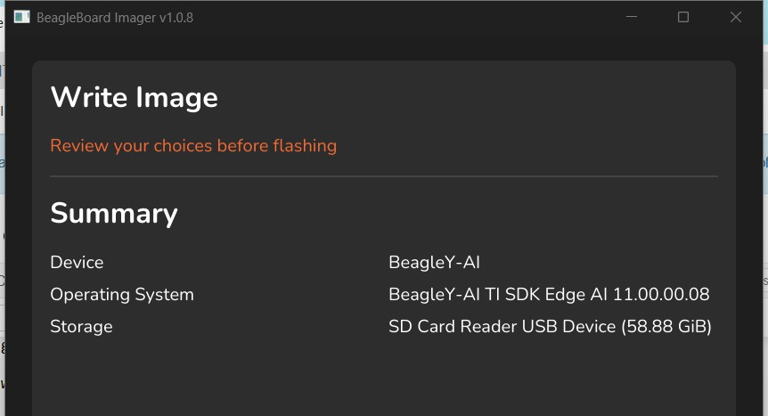
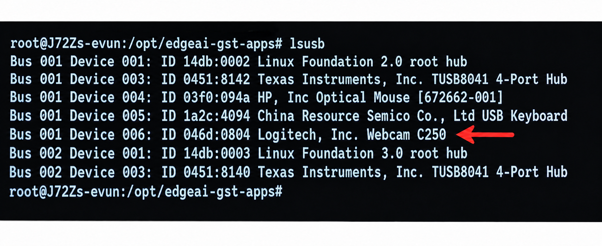
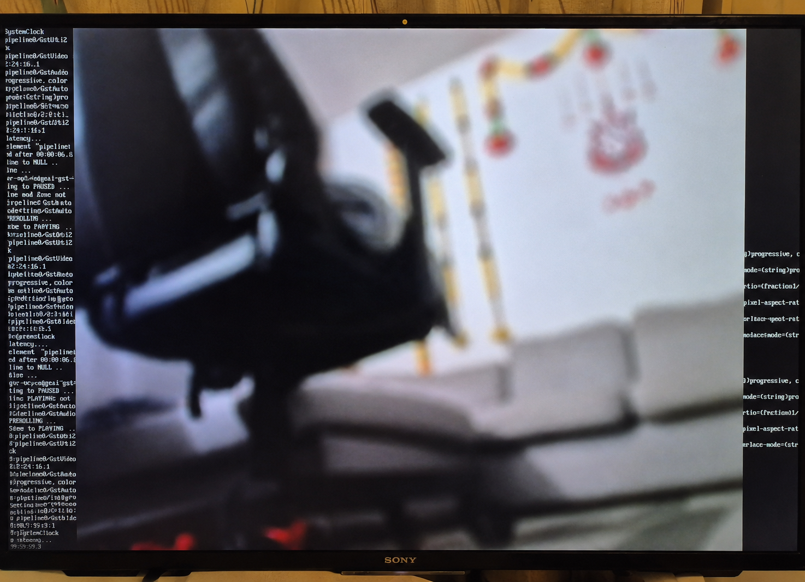
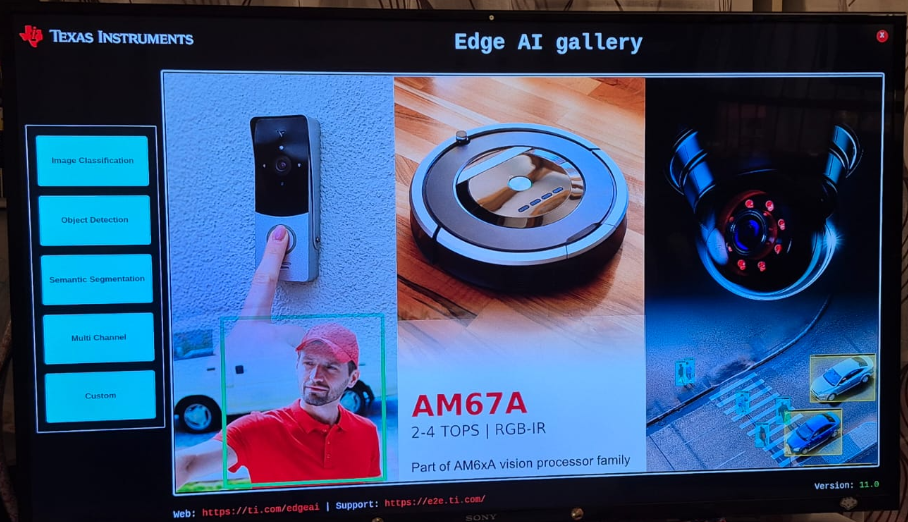
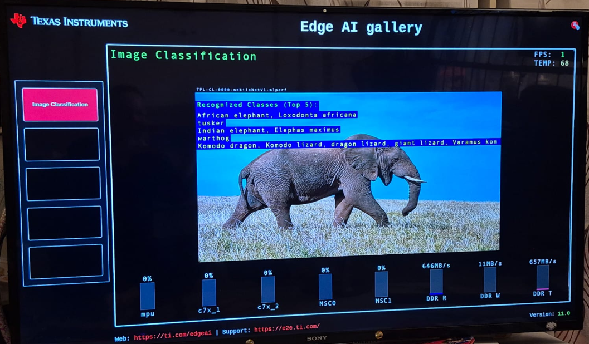

# BeagleY-AI Edge AI Demo Using USB Webcam and CSI Camera Module

This page describes the setup and testing of the BeagleY-AI board with two camera configurations: first with a USB webcam, and later with a CSI camera module connected using a ribbon cable.

## Board Overview

BeagleY-AI is an open-source single-board computer developed for edge AI applications. It is based on the Texas Instruments AM67A vision processor and includes hardware for AI and vision processing. This allows the board to run lightweight AI tasks locally.

Figure 1 shows the front and back views of the BeagleY-AI board.



*Figure 1. Front and back views of the BeagleY-AI board.*

The following official BeagleY-AI documentation can be used as the main reference:

* [BeagleY-AI official documentation](https://docs.beagleboard.org/boards/beagley/ai/)
* [BeagleY-AI introduction](https://docs.beagleboard.org/boards/beagley/ai/01-introduction.html)
* [BeagleY-AI quick start](https://docs.beagleboard.org/boards/beagley/ai/02-quick-start.html)
* [Using Edge AI demo](https://docs.beagleboard.org/boards/beagley/ai/demos/using-edge-ai.html)

## Edge AI

Edge AI refers to artificial intelligence models running locally on a device, which reduces the need to send data to a cloud server for processing.

The basic idea is:

Camera input → BeagleY-AI → Edge AI model → detection result

This approach is useful because the board can analyse camera data directly and produce detection results locally. As a result, the system can respond faster and does not fully depend on cloud processing or a network connection.

## Hardware Used

| Hardware                                                | Purpose                                |
| ------------------------------------------------------- |----------------------------------------|
| BeagleY-AI board                                        | Main board for the Edge AI demo        |
| 64 GB microSD card                                      | Storage used for flashing the OS image |
| USB-C power supply                                      | Power supply for the board             |
| Logitech C250 USB webcam                                | Camera input for Demo 1                |
| Raspberry Pi Camera Module 2 (IMX219) with ribbon cable | Camera input for Demo 2                |
| Active cooling system / fan                             | Cooling during testing                 |
| HDMI display                                            | Visual output for the Edge AI GUI      |
| USB mouse                                               | GUI control                            |
| USB keyboard                                            | Text input and terminal control        |
| Laptop                                                  | Setup computer                         |

Two camera setups were tested:

* Demo 1: Logitech C250 USB webcam
* Demo 2: Raspberry Pi Camera Module 2 (IMX219) 


## Setup Steps

1. Download and flash the correct operating system image to the microSD card.


   Useful links:

   * [Link to recommended OS image](https://www.beagleboard.org/distros/beagley-ai-ti-sdk-edge-ai-11-00-00-08-2025-09-06)
   * [Link to flashing tool: bb-imager](https://www.beagleboard.org/bb-imager)
   * [How to flash OS using bb-imager](https://docs.beagleboard.org/boards/beagley/ai/02-quick-start.html#beagley-ai-bb-imager)

   The minimum required selections in bb-imager are the device name, operating system image, and target storage. Other custom options, such as username, password, network settings, and other settings, can be skipped if they are not needed.

   

   *Figure 2. bb-imager summary with minimum selections.*


2. Insert the microSD card into the BeagleY-AI board.


3. Connect the required peripherals: power supply, HDMI display, USB keyboard, USB mouse, and active cooling system. For Demo 1, connect the Logitech C250 USB webcam. For Demo 2, connect the Raspberry Pi Camera Module 2 IMX219 using the ribbon cable.


4. Boot the board and check that the system starts correctly.

   After booting, the board opens a terminal login screen. According to the official Edge AI documentation, the default login user is `root`, and no password is required.

## Demo 1: Logitech C250 USB Webcam
* Check whether the USB webcam is detected.

   Useful commands for checking the webcam:

   ```bash
   lsusb
   ls /dev/video*
   v4l2-ctl --list-devices
   ```

   The `lsusb` command is used to list USB devices connected to the system. Figure 3 shows the detected USB devices, including the Logitech Webcam C250.

   

   *Figure 3. USB devices detected by the system, including Logitech Webcam C250.*


* Start a video stream using the detected webcam.

   After the webcam is connected, the available video devices are checked with:

   ```bash
   ls /dev/video*
   ```

   In this setup, the Logitech C250 webcam was available as `/dev/video2`. The following command was used to test the live camera stream:

   ```bash
   gst-launch-1.0 -v v4l2src device=/dev/video2 ! videoconvert ! autovideosink
   ```

   The command opens a live video stream on the display. This confirmed that the webcam was detected correctly and could be used as a video input device.

   

   *Figure 4. Live video stream from the Logitech C250 webcam.*


* Start the Edge AI graphical interface.

   The Edge AI graphical interface is started with the following command:

   ```bash
   edgeai-gui-app --platform linuxfb
   ```

   After running the command, the Edge AI gallery opens on the display. There are several demo options, including Image Classification, Object Detection, Semantic Segmentation, Multi Channel, and Custom.

   

   *Figure 5. Edge AI gallery main screen with available demo options.*


   The Image Classification demo was tested first. The demo showed example images and recognised classes on the screen.

   

   *Figure 6. Image Classification demo running in the Edge AI gallery.*


   **Note:** The top-right corner of the interface shows useful runtime information, such as FPS (frames per second) and board temperature.

## Difficulties and Limitations of Demo 1

During testing with the Logitech C250 USB webcam, the camera stream worked correctly. However, running the USB webcam together with the Edge AI object detection demo was not stable in this setup. The system froze during the test, and the keyboard and mouse became inactive.

Useful command to stop the Edge AI GUI:

```bash
killall edgeai-gui-app
```

If the graphical interface is open but the terminal is needed, try switching to another terminal using:

```text
Ctrl + Alt + F1
Ctrl + Alt + F2
Ctrl + Alt + F3
```

If the system becomes fully unresponsive and keyboard or mouse input does not work, the last option is to power off the board. This should be used only when the system cannot be controlled in any other way.

In this test, the keyboard and mouse became inactive during the attempt to run the USB webcam live-stream object detection demo. Because of this, the object detection test with the USB webcam was not completed and requires further investigation. 

## Demo 2: Raspberry Pi Camera Module 2 (IMX219)
* Configure the camera settings according to the official BeagleY-AI documentation:

  * [Instructions for setting up the camera module](https://docs.beagleboard.org/boards/beagley/ai/demos/using-edge-ai.html#camera-configuration)

* Start the Edge AI graphical interface.

  The Edge AI graphical interface is started with the following command:

  ```bash
  edgeai-gui-app --platform linuxfb
  ```

* Choose **Custom** from the menu on the left and select:

  * **Input type:** camera
  * **Camera:** attached Raspberry Pi Camera Module 2 (IMX219)
  * **Model:** suitable Edge AI model

In this demo, the Raspberry Pi Camera Module 2 (IMX219) was used together with an Edge AI model. The setup successfully demonstrated camera-based object/face detection. No major limitations were observed during this test.

## Conclusion and Recommendation

The BeagleY-AI board was successfully set up with the recommended TI Edge AI for BeagleY-AI image. Two camera setups were tested: a Logitech C250 USB webcam and a Raspberry Pi Camera Module 2 (IMX219).

The USB webcam was detected correctly and worked for a basic video stream, but it was not stable when used as input for the Edge AI object detection demo. The Raspberry Pi Camera Module 2 (IMX219) worked more reliably as the camera input for the Edge AI demo, and therefore this camera module is recommended when running camera-based Edge AI on BeagleY-AI.